# 🚀 BrandPulse AI
### From Business Idea to Full-Funnel Campaign – Powered by AI

<p align="center">
  
  
  
  
  
  
  
  
  
</p>

---

## 📌 Overview

BrandPulse AI is an **all-in-one marketing intelligence platform** that transforms a raw business idea into a complete, execution-ready campaign.

Instead of switching between multiple tools and repeatedly entering the same information, BrandPulse allows users to define an idea **once**, then automatically reuse that context across all campaign activities.

The platform intelligently connects:

- AI strategy generation
- Creative content generation
- Audio advertisement generation
- Influencer discovery
- Outreach drafting
- Persistent cloud storage

All under one unified workflow.

---

## 🌟 Why BrandPulse AI?

- 🧠 **One Idea, One Workflow** — No repetitive inputs or context switching
- 🤖 **AI First Approach** — Generate strategies, content, scripts, and ads
- 📊 **Always in Sync** — Persistent Firestore-backed data across sessions
- 🎧 **Multimedia Campaign Generation** — Text + Audio advertisements
- 🔎 **Smart Influencer Discovery** — Creator search using YouTube APIs
- 🔒 **Secure & Personalized** — Google authentication with isolated user data

---

# 📷 Application Preview

### 🏠 Landing Page

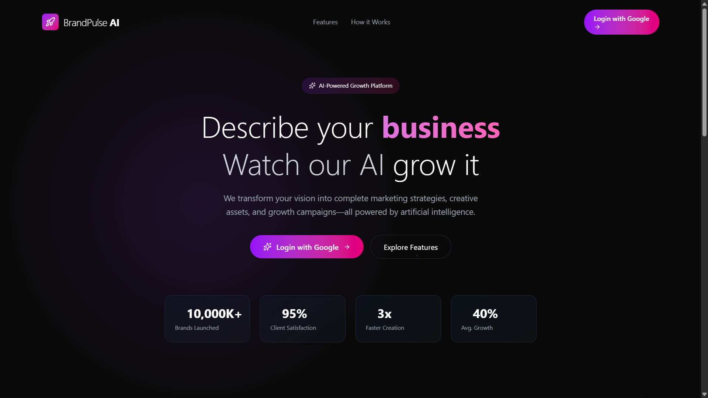

---

### 📊 Dashboard

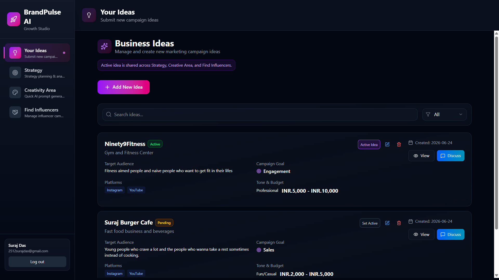

---

### 💡 Your Ideas — Central Campaign Hub

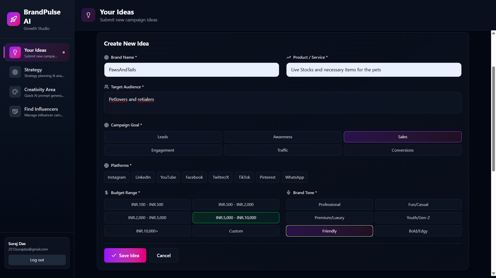

---

### 🧠 AI Strategy Generator

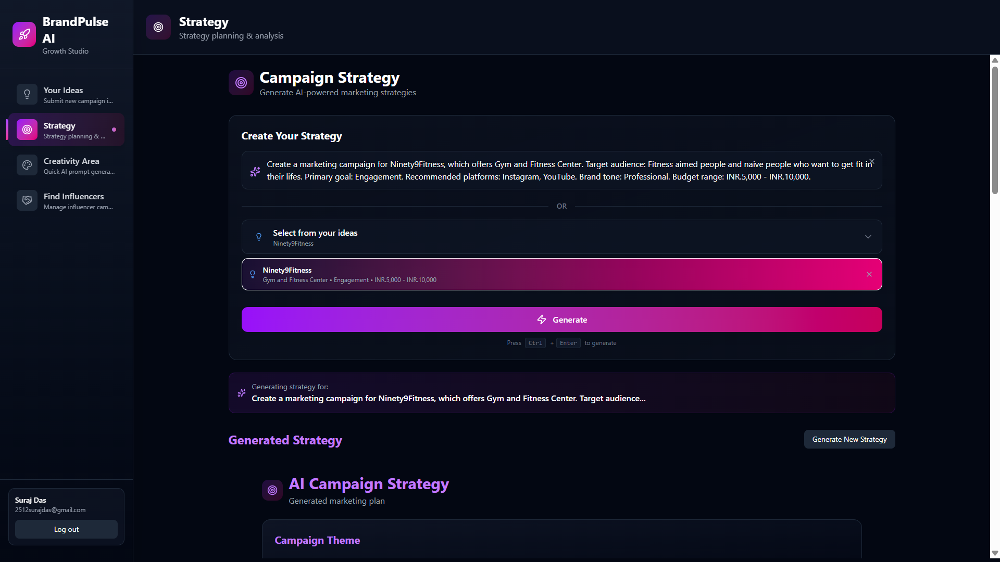

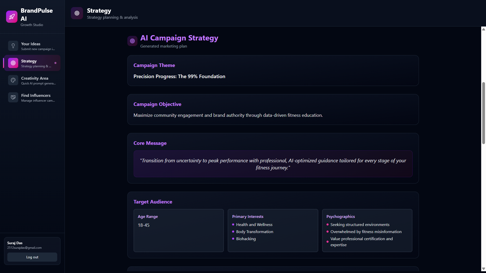

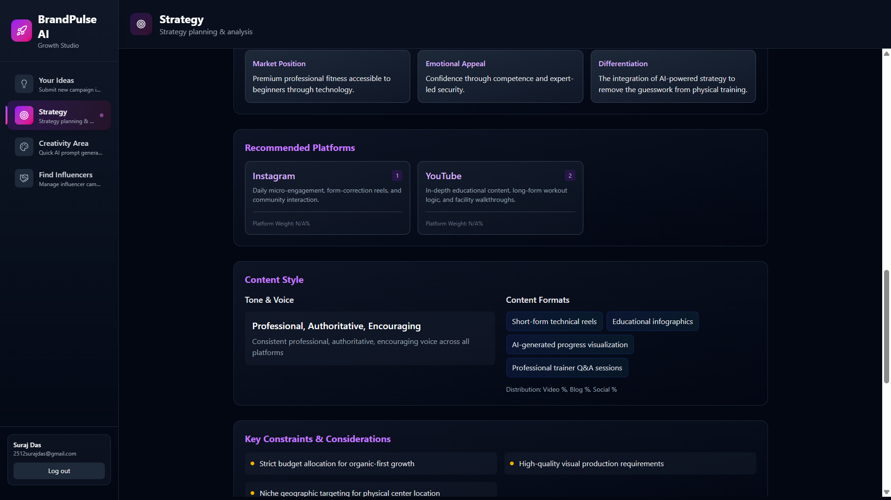

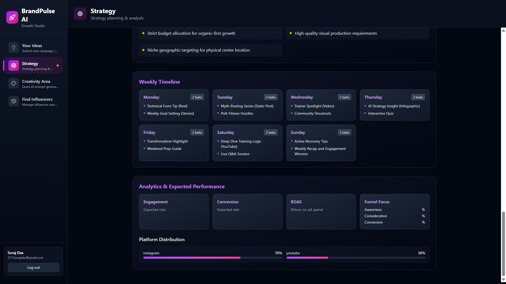

---

### 🎨 Creative Content Generator

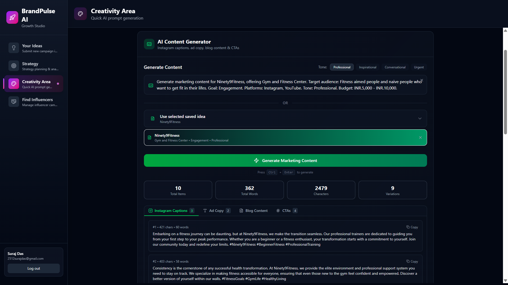

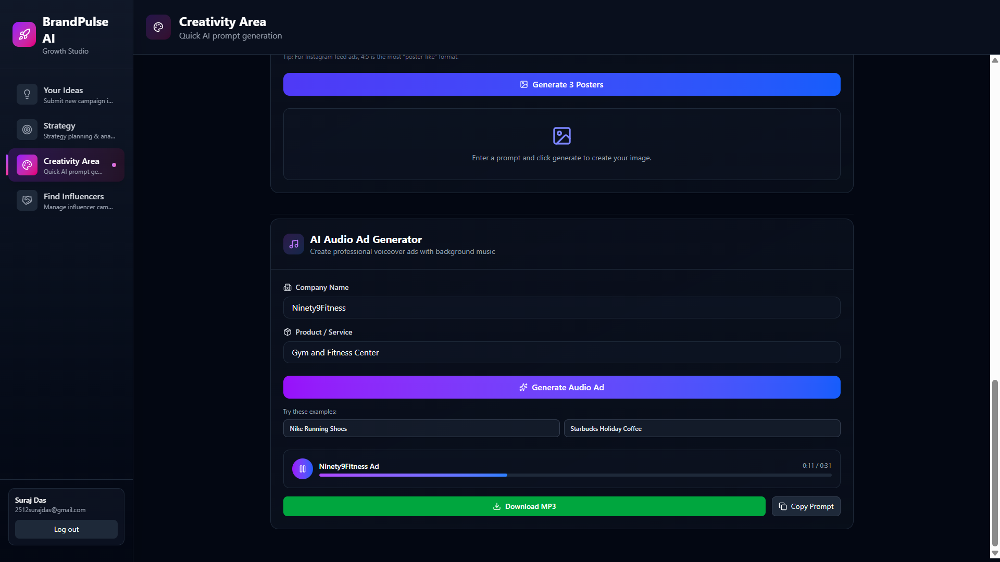

---

### 👥 Influencer Discovery Engine

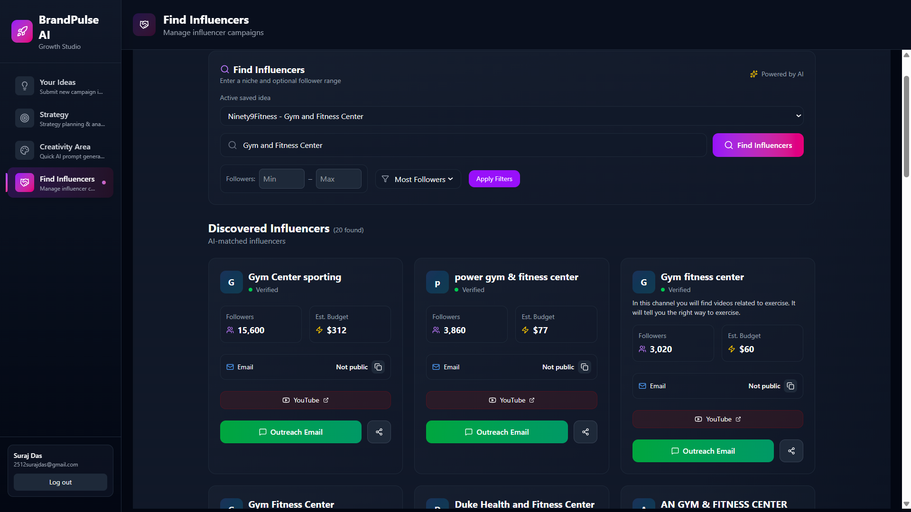

---

# 🎥 Demo

Experience BrandPulse AI live:

🔗 **[Launch App](https://brand-pulse-three.vercel.app/)**

Prefer a walkthrough?

🎬 **[Watch Demo](YOUR_VIDEO_LINK)**

---

## ✨ Core Features

| Feature | Description | Powered By |
|-----------|-------------|-------------|
| 🔐 **Google Authentication** | One-click login, protected routes, persistent sessions | Firebase Auth |
| ☁️ **Cloud Database** | Save, edit, delete campaign ideas with user isolation | Firestore |
| 🧠 **AI Strategy Generator** | Marketing strategy, audience targeting, campaign planning | Gemini |
| 🎨 **Creative Content Generator** | Headlines, captions, CTAs, ad copy generation | Gemini |
| 🎤 **Audio Ad Studio** | Script generation and AI voice synthesis | Gemini + ElevenLabs |
| 👥 **Influencer Discovery** | Search creators, filter audiences, outreach generation | YouTube API + Gemini |
| 🔄 **Unified Workflow** | One campaign idea powers every module | React Context + Express |

---

# 🏗️ System Architecture

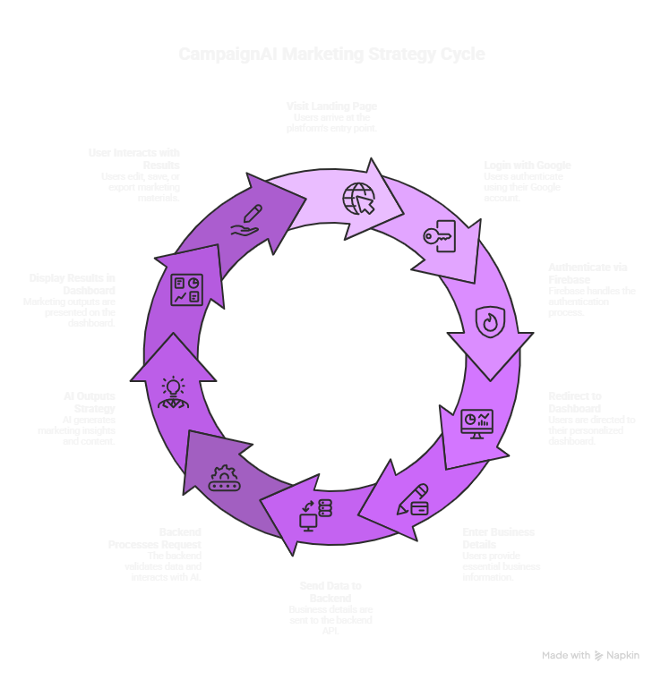

---

### ⚖️ Traditional Workflow vs BrandPulse AI

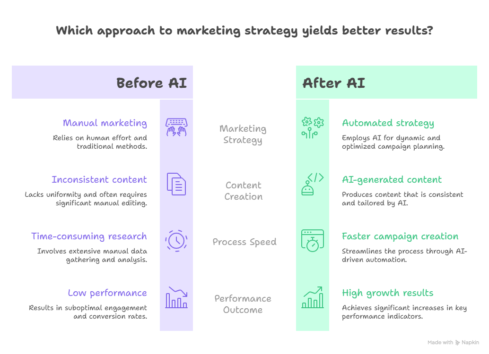

---

## High-Level Flow

```text
User
   │
   ▼
React + Vite Frontend
   │
   ├── Firebase Authentication
   ├── Firestore Database
   └── Express Backend APIs
         │
         ├── Gemini (AI Text Generation)
         ├── ElevenLabs (Voice Synthesis)
         └── YouTube Data API (Influencer Discovery)
```

---

## 📈 Problems Solved

### Context Fragmentation

Traditional workflows require users to repeatedly provide campaign information.

BrandPulse solves this through:

- Shared active campaign context
- Cross-module synchronization
- Single-source campaign intelligence

---

### Persistent Data Storage

Migrated from browser-only storage to:

- Cloud Firestore
- User-specific data access
- Cross-device synchronization

---

### AI Workflow Integration

Integrated multiple AI providers into one workflow:

- Gemini
- ElevenLabs
- YouTube Data API

---

### Better Error Handling

Added:

- Backend API validation
- User-friendly errors
- API failure transparency
- Fallback states

---

## ⚙️ Tech Stack

### Frontend

- React
- Vite
- Tailwind CSS
- React Router
- Context API

### Backend

- Node.js
- Express
- node-fetch
- dotenv

### Authentication

- Firebase Authentication
- Google OAuth

### Database

- Firebase Firestore

### AI Services

- Google Gemini
- ElevenLabs

### External APIs

- YouTube Data API v3

---

## 📂 Project Structure

```text
BrandPulse/
│
├── frontend/
│   ├── src/
│   ├── pages/
│   ├── components/
│   ├── context/
│   └── firebase.js
│
├── backend/
│   ├── routes/
│   ├── services/
│   ├── lib/
│   └── server.js
│
├── screenshots/
│
└── README.md
```
## 🚀 Installation & Local Setup

### Prerequisites

Make sure the following are installed on your system:

- Node.js (v16+ recommended)
- npm or yarn
- Firebase project setup
- Gemini API Key
- YouTube Data API Key
- ElevenLabs API Key

---

## 1️⃣ Clone Repository

```bash
git clone [https://github.com/yourusername/BrandPulse-AI.git](https://github.com/Sujju-192/BrandPulse.git)

cd BrandPulse-AI
```

---

## 2️⃣ Backend Setup

Navigate to backend:

```bash
cd backend
```

Install dependencies:

```bash
npm install
```

Create:

```bash
backend/.env
```

Add the following:

```env
GEMINI_API_KEY=your_gemini_api_key

YOUTUBE_API_KEY=your_youtube_api_key

ELEVENLABS_API_KEY=your_elevenlabs_api_key

ELEVENLABS_VOICE_ID=your_voice_id
```

Start backend:

```bash
npm run dev
```

Backend starts on:

```bash
http://localhost:3000
```

---

## 3️⃣ Frontend Setup

Open another terminal.

Move into frontend:

```bash
cd frontend
```

Install dependencies:

```bash
npm install
```

Create:

```bash
frontend/.env
```

Add:

```env
VITE_API_URL=http://localhost:3000
```

Run frontend:

```bash
npm run dev
```

Frontend starts on:

```bash
http://localhost:5173
```

---

## 4️⃣ Firebase Setup

Create a Firebase project:

1. Open Firebase Console
2. Create a new project
3. Enable Google Authentication
4. Create Firestore Database
5. Select production mode or test mode
6. Copy Firebase configuration

Open:

```bash
frontend/src/firebase.js
```

Replace configuration:

```javascript
const firebaseConfig = {
  apiKey: "YOUR_API_KEY",
  authDomain: "YOUR_PROJECT.firebaseapp.com",
  projectId: "YOUR_PROJECT_ID",
  storageBucket: "YOUR_PROJECT.appspot.com",
  messagingSenderId: "YOUR_SENDER_ID",
  appId: "YOUR_APP_ID"
};
```

---

## 5️⃣ Enable Required APIs

### Google Gemini API

- Open Google AI Studio
- Generate API Key
- Copy key into `.env`

---

### YouTube Data API v3

Steps:

1. Open Google Cloud Console
2. Create project
3. Enable:

```text
YouTube Data API v3
```

4. Create credentials

5. Create:

```text
API Key
```

6. Restrict API key to:

```text
YouTube Data API v3
```

---

### ElevenLabs

Steps:

1. Create ElevenLabs account
2. Generate API key
3. Copy API key into `.env`
4. Select preferred Voice ID

---

## ▶️ Running Full Application

Start backend:

```bash
cd backend

npm run dev
```

Open another terminal:

```bash
cd frontend

npm run dev
```

Visit:

```bash
http://localhost:5173
```

---

## 📂 Project Structure

```text
BrandPulse-AI/
│
├── frontend/
│   │
│   ├── src/
│   ├── components/
│   ├── pages/
│   ├── context/
│   ├── hooks/
│   └── firebase.js
│
├── backend/
│   │
│   ├── routes/
│   ├── lib/
│   ├── services/
│   ├── middleware/
│   └── server.js
│
├── screenshots/
│
└── README.md
```

---

## 🔥 Firestore Rules (Development)

For testing:

```javascript
rules_version = '2';

service cloud.firestore {
  match /databases/{database}/documents {

    match /{document=**} {
      allow read, write: if request.auth != null;
    }

  }
}
```

---

## 🌐 Deployment

Frontend:

- Vercel

Backend:

- Render

Database & Authentication:

- Firebase

---

## ⚠️ Notes

- Ensure all API keys are valid
- Firestore database must be initialized
- Google Authentication must be enabled
- Invalid API keys may cause backend failures
- Backend URL should be updated for production deployment
